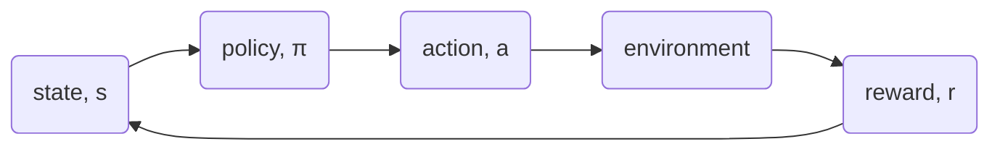
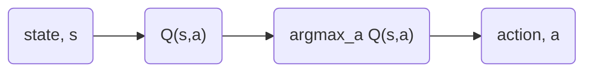
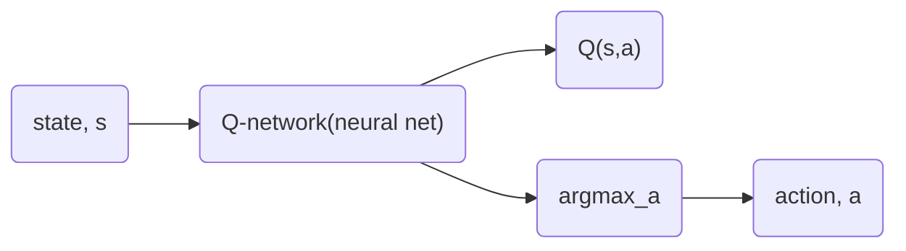
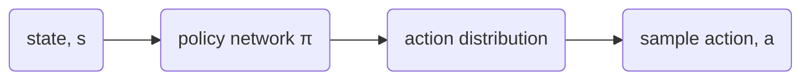
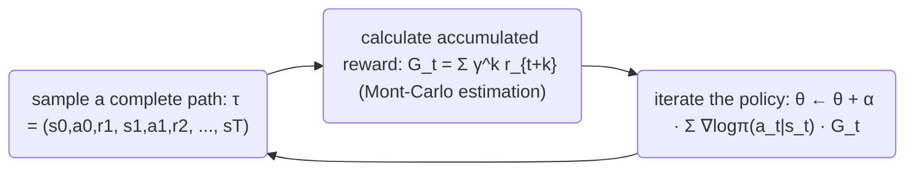
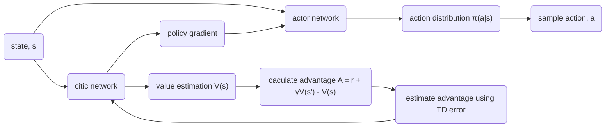
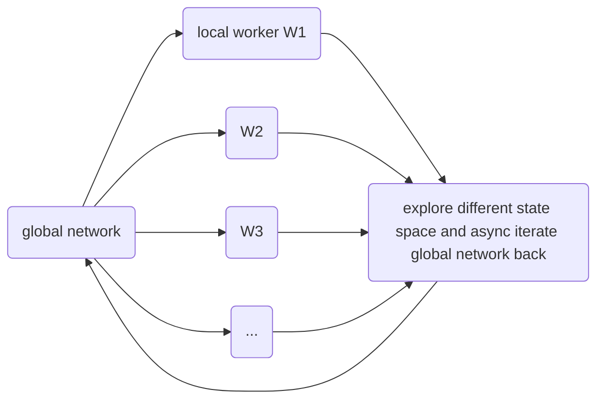
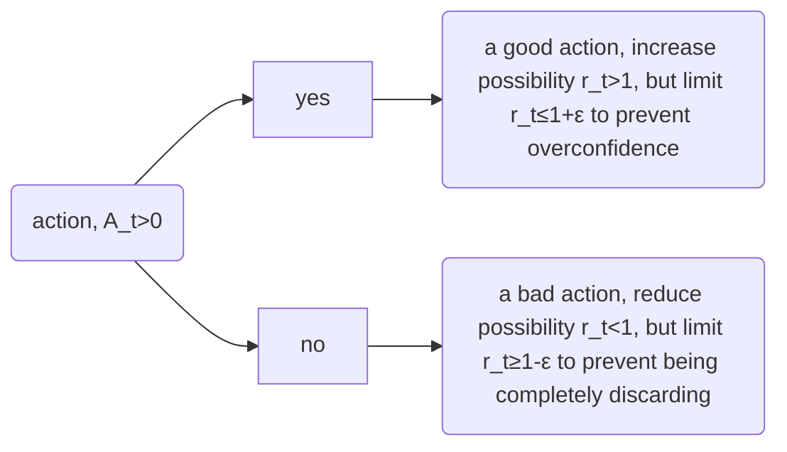
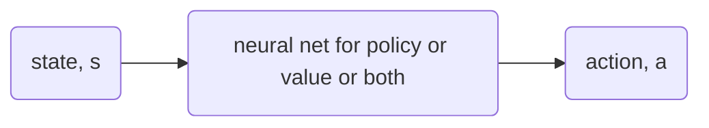

# Deep Reinforced Learning
## Reinforced learning
- maximize long-term reward through trial and error in an uncertain environment
- model architecture
    - state,s
        - what situation am I in?
        - Markov property
            - the future state of a random process only rely on present state (regardless of past paths)
            - $P(X_{n+1} = x | X_{n} = x_{n}, X_{n-1} = x_{n-1}, ..., X_{0} = x_{0}, ) = P(X_{n+1} = x_{n} | X_{n} = x_{n})$
            - if the state does not satisfy Markov, we need state stacking or use RNN or TRANSFORMER
    - policy, π
        - what should I do under state s?
        - $\pi(a|s)$
        - deterministic policy: $a = \pi(s)$
        - random policy: $\pi(a|s) = P(a|s)$
        - policy-based method: provided π
        - value-based method: get π through Q -> $\pi(s) = argmax Q(s,a)$
        - Bellman Equation
            - Bellman expectation equation (for policy $\pi$)
                - state value: $V^ {\pi } (s)= \sum _ {a} \pi (a|s) \sum _ {s'} P(s'|s,a)[R(s,a,s')+ \gamma V^ {\pi } (s')]$
                - action value: $Q^ {\pi } (s,a)= \sum _ {s'} P(s'|s,a)[R(s,a,s')+\gamma \sum _ {a'}\pi (a'|s')Q^ {\pi }(s',a')]$ 
            - Bellman optimality equation
                - state value: $V^ {\ast} (s)= \max _ {a} \sum _ {s'} P(s'|s,a)[R(s,a,s')+ \gamma V^ {\ast} (s')]$
                - action value: $Q^ {\ast} (s,a)= \sum _ {s'} P(s'|s,a)[R(s,a,s')+ \gamma \max _ {a}' Q^ {\ast} (s',a')]$

    - action, a
        - controls could be exerted by the agent to the environment
        - discrete action: DQN, PPO
        - continuous action: DDPG, TD3
    - reward, r
        - instant response from environment
    - value function
        - how's the long term result from now
        - state value function
            $V^{\pi}(s) = E_{\pi}[G_t|s_t = s]$
        - state-action value function
            $Q^{\pi}(s,a) = E_{\pi}[G_t|s_t = s, a_t = a]$
        - advantage function
            $A^{\pi}(s,a) = Q^{\pi}(s,a) - V^{\pi}(s)$

- purpose of RL
    - $maxE_{\pi}[\sum^{\infty}_{t=0}\gamma^tr_t]$
- difference from supervised learning:
    - no "right or wrong" label
    - action will influence future data distribution
    - long-term accumulated reward
- MDP (Markov Decision Process)
    - MDP = (S, A, P, R, $\gamma$); 
        - S: state space, set of all possible state
        - A: action space, set of all possible action
        - P(s'||s,a): state transmition possibility, the possibility of performing action a in state s that will transmit into state s'
        - R(s,a,s'): value function, instant reward after state transmition
        - $\gamma \in [0,1]$: discount factor, the decline constant for future reward
            - $\gamma \rightarrow 0$: short-sighted
            - $\gamma \rightarrow 1$: long-sighted
## Value-based learning
### Q-learning
- not learning policy, but directly learning the value of actions: use $argmax Q(s,a)$ to choose which action
- iterate formula
    $Q(s,a) \leftarrow Q(s,a) + \alpha[r + \gamma \max_{a'}Q(s',a') - Q(s,a)]$
- model architecture

### DQN (Deep Q-Network)
- use neural network to approximate Q-function
  $Q(s,a;\theta) \approx Q^{\ast}(s,a)$
- stable target network & experience replay
- model architecture


## Policy Gradient (PG)
- learn provided policy without argmaxQ, and output a possibility distribution $\pi_{\theta}(a|s)$
- pupose: maximize expetation reward
  $\theta_{new} = \theta_{old} + \alpha \cdot \nabla_{\theta}J(\theta_{old}),  \nabla_{\theta}J(\theta_{old})$: policy provided gradient
  $J(\theta) = E_{\pi_{\theta}}[R]$
- gradient:
  $\nabla_{\theta}J(\theta) = E[\nabla_{\theta}log\pi_{\theta}(a|s)\cdot R]$
- model architecture

### REINFORCE
- model architecture
for every episode:

```mermaid=
class REINFORCE:
    def update(self, trajectory):
        returns = []  # 计算累积奖励G_t
        G = 0
        for r in reversed(trajectory.rewards):
            G = r + self.gamma * G
            returns.insert(0, G)
        
        for (s, a, G_t) in zip(trajectory.states, trajectory.actions, returns):
            log_prob = self.policy.log_prob(s, a)
            loss = -log_prob * G_t  # 梯度上升 → 最小化负收益
            loss.backward()
```
- drawback: although using the same policy, the fluctuate in G_t will result in large noise in iteration
### Actor-Critic
- introduce value function into the model, use Critic to reduce variance
  REINFORCE: ∇logπ(a|s) · G_t
                ↓
Actor-Critic: ∇logπ(a|s) · A(s,a), where A(s,a) is the advantage $A(s,a) = Q(s,a) - V(s)$
- model architecture

```mermaid=
for each step:
    a = actor.sample(s)
    s', r = env.step(a)
    
    # Critic计算TD误差
    td_target = r + gamma * critic(s')
    td_error = td_target - critic(s)  # 即优势估计
    
    # 更新Critic（最小化TD误差）
    critic_loss = td_error^2
    
    # 更新Actor（策略梯度）
    actor_loss = -log_prob(a|s) * td_error.detach()
```
- common derivative:
    - Q Actor-ctitic:
        - critic output: Q(s,a), advantage A=Q(s,a)−V(s)
        - need two networks
    - A2C
        - critic output: V(s), advantage A=r+γV(s′)−V(s)
        - need only one network
        - sync, need to wait for all the  local workers to finish in one episode
### A3C (Asynchronous Advantage Actor-Critic)
- traditional single thread training like DQN or  A2C: sampling speed << training speed, and the only one path brings bias
- asynchronous(async) multithreading 

```mermaid=
import torch.multiprocessing as mp

class Worker(mp.Process):
    def __init__(self, global_actor, global_critic, env_name, worker_id):
        super().__init__()
        self.global_actor = global_actor
        self.global_critic = global_critic
        self.env = gym.make(env_name)
        self.worker_id = worker_id
        
        # 本地网络（结构相同，参数独立）
        self.local_actor = ActorNet()
        self.local_critic = CriticNet()
        
    def run(self):
        optimizer = SharedAdam(self.global_actor.parameters(), lr=0.0001)
        
        while True:
            # 1. 同步全局参数到本地
            self.local_actor.load_state_dict(self.global_actor.state_dict())
            self.local_critic.load_state_dict(self.global_critic.state_dict())
            
            # 2. 本地采样n步
            states, actions, rewards = [], [], []
            state = self.env.reset()
            for _ in range(20):  # n-step
                action = self.local_actor.sample(state)
                next_state, reward, done, _ = self.env.step(action)
                states.append(state); actions.append(action); rewards.append(reward)
                state = next_state
                if done: break
            
            # 3. 计算n步回报和优势
            R = 0 if done else self.local_critic(state).item()
            returns = []
            for r in reversed(rewards):
                R = r + 0.99 * R
                returns.insert(0, R)
            returns = torch.tensor(returns)
            values = self.local_critic(torch.stack(states))
            advantages = returns - values.squeeze()
            
            # 4. 计算损失
            log_probs = self.local_actor.log_prob(torch.stack(states), torch.stack(actions))
            actor_loss = -(log_probs * advantages.detach()).mean()
            critic_loss = advantages.pow(2).mean()
            total_loss = actor_loss + 0.5 * critic_loss
            
            # 5. 反向传播，梯度自动累积到全局网络（通过共享内存）
            optimizer.zero_grad()
            total_loss.backward()
            
            # 关键：共享内存机制使梯度自动写入global_net
            # 多个worker可能同时写，产生噪声但可接受
            
            # 6. 全局优化器步进
            optimizer.step()
```

### PPO
- a big policy change in policy gradient may lead to unstable training results
- rate of importance sampling
  $r_t(\theta) = \frac{\pi_{\theta}(a_t|s_t)}{\pi_{\theta_{old}}(a_t|s_t)}$
- clipped surrogate objective
  $L^{CLIP}(\theta) = E_t[min(r_t(\theta)A_t, clip(r_t(\theta), 1 - \epsilon, 1 + \epsilon)A_t)]$

```mermaid=
for iteration:
    # 1. 用当前策略收集N步数据
    data = collect_trajectories(env, pi_old, N)
    
    # 2. 计算优势（GAE - Generalized Advantage Estimation）
    advantages = compute_GAE(data, critic)
    
    # 3. 多次小批量更新（数据复用！）
    for epoch in range(K_epochs):
        for minibatch in data.shuffle().batch():
            # 新策略概率
            pi_new = actor(minibatch.states)
            ratio = pi_new / pi_old
            
            # Clipped目标
            surr1 = ratio * advantages
            surr2 = clip(ratio, 0.8, 1.2) * advantages  # ε=0.2
            actor_loss = -min(surr1, surr2).mean()
            
            # Critic损失（MSE）
            critic_loss = (critic(minibatch.states) - returns)^2
            
            # 总损失
            loss = actor_loss + c1*critic_loss - c2*entropy_bonus
            
            optimizer.step()
    
    pi_old = pi_new  # 更新旧策略
```
## DeepRL
- RL + Deep Neural Network
- use neural network to do 
    - representational learning
      e.g. CNN(image), RNN/Transformer(sequence), GNN(multiagent)
    - funciton approximation 
      e.g. V(s)≈V(s;θ), Q(s,a)≈Q(s,a;θ), π(a∣s)≈πθ


## WK4 Q
1.强化学习的目标是什么?
最大化长期的回报

2.DQN 和Q-learning 的区别是什么?
DQN是用拟合的神经网络去得到Q值，而Q-learning是直接给每一个离散的(s,a)储存一个Q值

3.为什么 PPO在实际中比 REINFORCE更稳定?
因为PPO限制了单次更新的幅度，不让策略过于激进的得到reward也不会完全抛弃不好的action；REINFORCE的方差大，步长一旦设置不当，一次比较大的更新就会改变策略很多，导致结果不稳定

4.A3C的优势是什么?
async multithread架构，使得模型可以快速地进行不同的路线的探索


## Plus
*notes for study & xbot sim2sim & thanks to 王树森深度强化学习全套课程*
